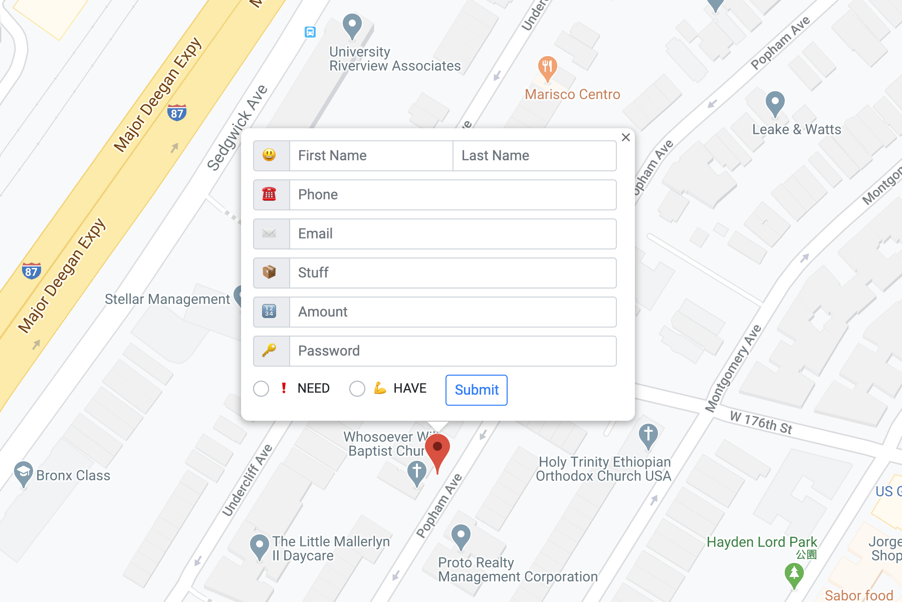
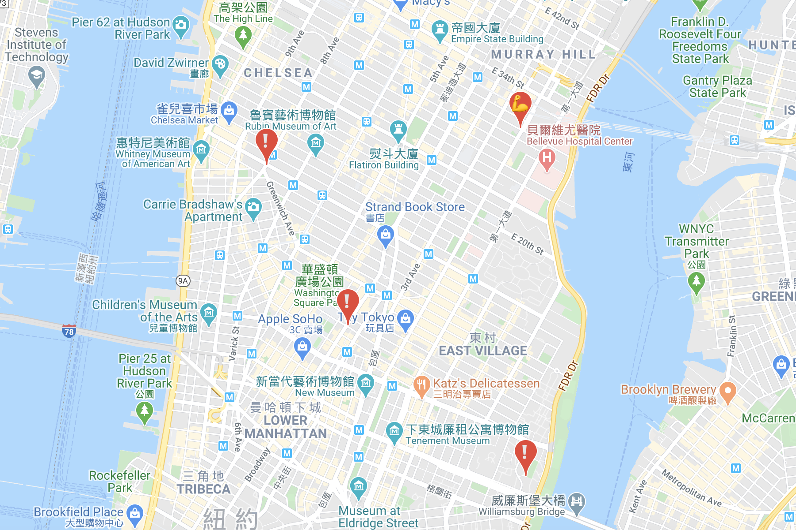
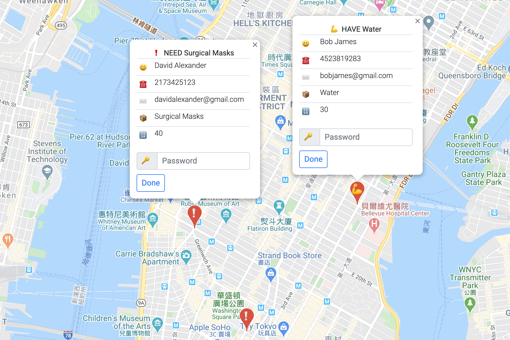

# SuppliesMapForCov19

A map shows who need supplies and who have supplies.

## Link

[https://strong-host-272520.appspot.com/](https://strong-host-272520.appspot.com/)

## Github

[https://github.com/aaronlai1027/rowdyhacks2020](https://github.com/aaronlai1027/rowdyhacks2020)

## Team members

* Tai-Ying Chen
  * Github: [https://github.com/taiyingchen](https://github.com/taiyingchen)
  * Discord ID: taiyingchen#9966
* Aaron Lai
  * Github: [https://github.com/aaronlai1027](https://github.com/aaronlai1027)
  * Discord ID: Aaron#2165

## Functionalities

* Add supplies information on Google Map
* Check others supplies information
* Muscle emoji - Means you HAVE supplies and you CAN HELP
* Exclamation emoji - Means you NEED supplies and you NEED HELP
* Click Done button if you already got or send the supplies
* Use a one-time password to manage each marker
* Can only click Done button with the one-time password

## Tech Stack

Build with

* Python
* Flask
* HTML/CSS/JS
* Google Map JavaScript API
* Google Cloud Platform Firestore
* Google Cloud Platform App Engine
